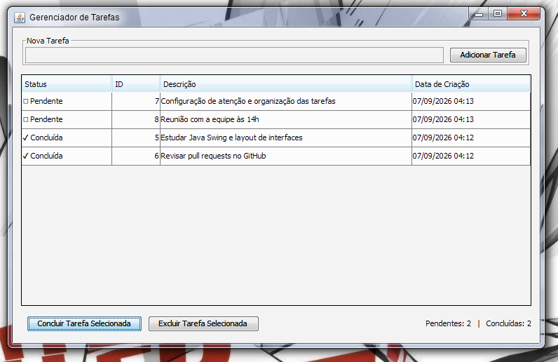
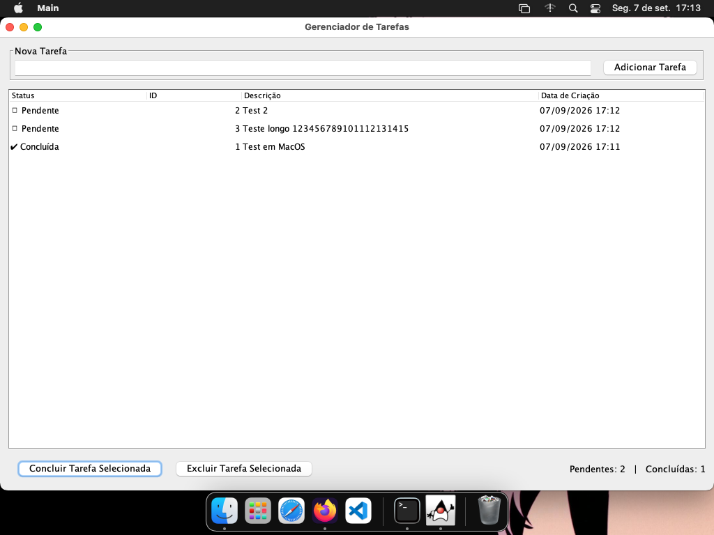
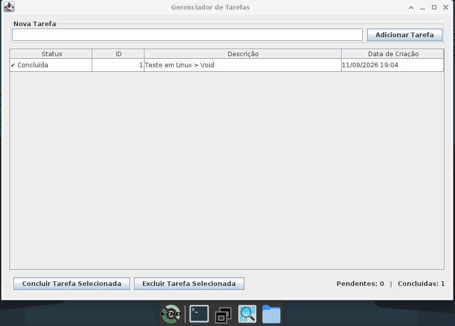

**[PT-BR 🇧🇷 ]([README.md](README.md))** |   **[ENG ]**

# 📋 Task Manager — Java Swing

Desktop task management application (**Task Manager**), built with **pure Java + Swing**, with local persistence to a text file (`tasks.txt`) and a layered architecture (Model / Repository / Service / View).

Designed as a portfolio project: organized, commented, testable code with no external runtime dependencies (JDK only).


---

## ✨ Features

- Add new tasks via a text field (or by pressing **Enter**).
- List tasks in a table (`JTable`) with **Status**, **ID**, **Description**, and **Creation Date** columns.
- Mark the selected task as completed.
- Delete the selected task (with a confirmation dialog).
- Validations and alerts via `JOptionPane` (empty description, no task selected, task already completed, delete confirmation, save error).
- Automatic persistence:
  - **Loads** tasks from `tasks.txt` when the window opens.
  - **Saves** on every change (add/complete/delete) and also when the window is closed.

---


<div align="center">

  <h2>💻 Cross-Platform Desktop Compatibility</h2>

  <p>
    Because it uses <b>Java Swing</b>, the interface automatically adapts to the native <i>Look & Feel</i> of each operating system, keeping the same functionality and data persistence on Windows, macOS, and Linux.
  </p>

  <br>

  <h3>Windows 🪟</h3>
  

  <br><br>

  <h3>MacOS 🍎 / Linux 🐧</h3>
  <h3>MacOS</h3>
  
  <br>
  <h3>Void Linux</h3>
   

</div>

---

## 🗂️ Project Structure

```
task-manager/
├── pom.xml
├── README.md
├── README.en.md
├── SECURITY.md
├── SECURITY.en.md
├── .gitignore
└── src/
    ├── main/java/com/taskmanager/
    │   ├── Main.java                          # Entry point (SwingUtilities.invokeLater)
    │   ├── model/
    │   │   └── Task.java                       # Task entity
    │   ├── repository/
    │   │   ├── TaskRepository.java             # Persistence contract
    │   │   └── FileTaskRepository.java         # Persistence via java.nio.file (Files/Paths)
    │   ├── service/
    │   │   ├── TaskService.java                # Business rules (Java Collections API)
    │   │   └── TaskNotFoundException.java      # Domain exception
    │   └── view/
    │       ├── MainFrame.java                  # Main window (JFrame) + Swing components
    │       └── TaskTableModel.java             # Custom TableModel for the JTable
    └── test/java/com/taskmanager/service/
        └── TaskServiceTest.java                # Unit tests (JUnit 5) for the service layer
```

### Why this organization?

| Package       | Responsibility                                                                 |
|---------------|-----------------------------------------------------------------------------------|
| `model`       | Domain entity (`Task`), with no business or infrastructure logic.        |
| `repository`  | Isolates persistence (text file) behind an interface (`TaskRepository`), allowing the implementation to be swapped or faked in tests. |
| `service`     | Concentrates business rules (validation, ID generation, sorting, counters) and orchestrates the repository. This is the layer tested with JUnit. |
| `view`        | Swing components. Doesn't know the repository directly — depends only on `TaskService`. |

---

## ✅ Prerequisites

- **JDK 17** or higher, installed and configured in `PATH`.
- **Apache Maven 3.8+** (optional, but recommended — used for building, testing, and packaging).

Check with:

```bash
java -version
javac -version
mvn -version
```

---

## ▶️ How to Build and Run

### Option A — Using Maven (recommended)

**Linux / macOS (bash):**

```bash
# From the project root (where pom.xml is)
mvn clean package

# Run the GUI from the generated JAR
java -jar target/task-manager.jar
```

**Windows (PowerShell):**

```powershell
# From the project root (where pom.xml is)
mvn clean package

# Run the GUI from the generated JAR
java -jar target\task-manager.jar
```

To run only the unit tests:

```bash
mvn test
```

> The `tasks.txt` file is created automatically in the directory from which the `java -jar ...` command is run (usually the project root).

---

### Option B — Without Maven (using only `javac`/`java`)

**Linux / macOS (bash):**

```bash
# From the project root
mkdir -p out

# Compile all production classes
javac -d out -encoding UTF-8 $(find src/main -name "*.java")

# Run the GUI
java -cp out com.taskmanager.Main
```

**Windows (PowerShell):**

```powershell
# From the project root
New-Item -ItemType Directory -Force -Path out | Out-Null

# Compile all production classes
Get-ChildItem -Recurse -Filter *.java src\main | ForEach-Object { $_.FullName } | Out-File sources.txt
javac -d out -encoding UTF-8 "@sources.txt"

# Run the GUI
java -cp out com.taskmanager.Main
```


## 💾 `tasks.txt` File Format

Each line represents a task, in the format:

```
id|completed|createdAt|description
```

Example:

```
1|false|2026-09-07T14:32:10.123456|Study Java Swing
2|true|2026-09-07T14:35:02.987654|Review Pull Request
```

> For simplicity, any `|` character present in the description is replaced with `/` before saving, to avoid ambiguity in the parser. Corrupted or unexpectedly formatted lines are ignored when loading, without interrupting the application.

---

## 🚀 Possible Improvements

- Edit the description of an existing task.
- Filter/search by status or text in the table.
- Persistence in SQLite/JSON.
- Internationalization (i18n).
- Native packaging with `jpackage` (`.exe`/`.dmg`/`.deb` installer).

---

## 📄 License

Portfolio project, free to study and reuse.


###  🌘 Author
* *Shadow_Voidh:* [Github](https://github.com/shadowvoidh)

###  📬 Contact
* *GitHub:* [@shadowvoidh](https://github.com/shadowvoidh)
* *Instagram:* [@shadow_voidh](https://www.instagram.com/shadow_voidh/)
* *LinkedIn:* [Pedro Carnio](https://linkedin.com/in/pedrocarnio)
* *Discord:* shadow_voidh
* *E-mail:* shadow.voidh@gmail.com
